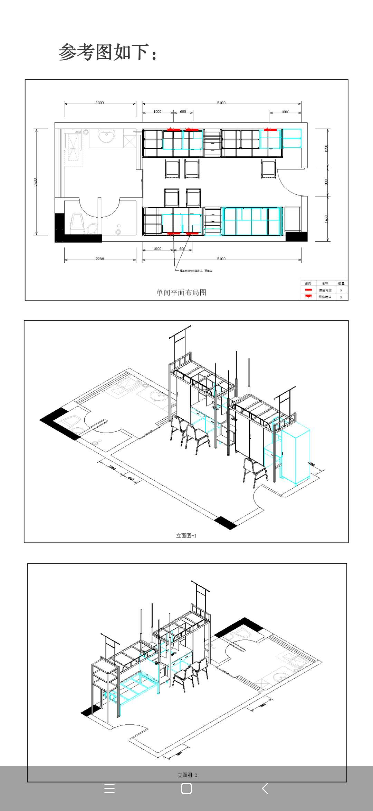

# 宿舍环境改善指南

更新于2022年8月16日，Author(s): 淑慧

今年南校新生大概率被分配至T4、T5和T10，T4和T10曾经是混寝（即原则上同一层楼的都是男生或女生，但同一栋楼的有男生和女生）

T4宿舍进门左右两边分别为：沐浴房（带洗手盘）、厕所（带洗手盘）
T5、T10沐浴房和厕所均在阳台上
厕所为坐便！

**床具一定要提前买好寄到学校，开学的时候兴安只有¥1,000的高价床垫出售**

**洗衣机抵达当日跟舍友商量好直接去京东买，次日就能送到
洗衣机安装很简单，插电插水管就行，请一定不要听信学长“包安装”洗衣机的谗言**

**每一年都有学长学姐推销床具、床垫、洗衣机、电动车、高顿CFA FRM ACCA、新东方雅思托福等等等等，请务必要警惕，他们的油水异常丰厚，谨防被割韭菜**

参考宿舍内布局（基于T11，和T5、T10一样）：

## 宿舍数据（基于2019年测量）

以下数据单位：厘米

1. 行李箱格：59（高）x 110（宽），深度没办法量，目测50-60

2. 阳台：105（宽）x 330（长），左边为放洗衣机的位置（足够大），有水龙头、电源、排水口、置物架。右边为洗手盘（有置物架）。

3. 床：90（宽）x 190（长），下床高133

4. 单桌有一个插座和rj45网线接口，双人桌两人共用一个插座和网线口

    单桌：74（长）x 50（宽）

    双人桌：60（长）x 50（宽）

    放得下电竞椅、27寸显示器和台式电脑

    建议加一张桌子或者去淘宝购买[一块木板](https://m.tb.cn/h.fCkh81q?tk=MfZh2IqEIcd)架在抽屉上

5. 衣柜（一人一个，下部分有门，上部分没门，请自备小锁）

    有门部分：55（宽）x 57（深）x 118（高）

    没门部分：47（高）x 55（宽）x 57（深）

6. 出阳台门边到床距离：41（宽）/边

8. 楼梯储物格：25（深）x 40（内宽），共4个，舍友自行分配

9. 宿舍有地方放饮水机（可以向宿管购买桶装水），有需要的同学可自行购买热水壶在宿舍使用。

10. 洗澡热水开放时间：6:30-8:30， 11:30-14:00，17:30-23:30

11. 原则上同一层楼的都是男生或女生，但同一栋楼的有男生和女生。

 精确数据可以参考[cad文件](https://github.com/deviantplayer/jnu-survival-manual/blob/main/%E6%9A%A8%E5%8D%97%E5%A4%A7%E5%AD%A6%E7%95%AA%E7%A6%BA%E6%A0%A1%E5%8C%BA%E5%AD%A6%E7%94%9F%E5%AE%BF%E8%88%8D%E8%A3%85%E4%BF%AE%E6%94%B9%E9%80%A0%E5%B7%A5%E7%A8%8B0505.dwg)

